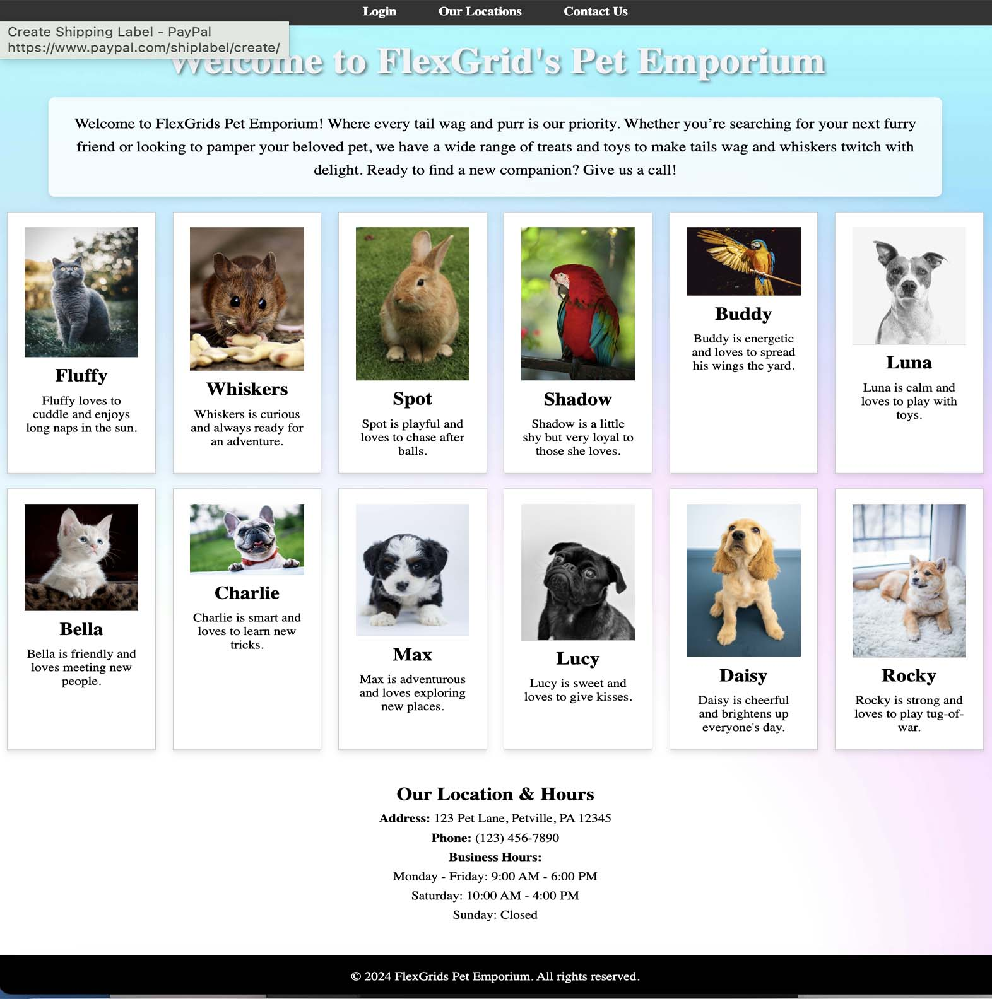

# Advanced Flexbox and Grid

## FlexGrid Pet Emporium


## Description
In this assignment, with step-by-step assistance from AI, you will utilize Flexbox and CSS Grid to create a responsive pet store webpage. "FlexGrid's Pet Emporium". Now let's get started.

## Project Structure

```
grid_layout_project
│   index.html
│   styles.css
```

## Project Setup Steps

- [x ] **Create the Project Folder:**
  - [ x] Create a main project folder named `FlexGridsPetEmporium`.

- [x ] **Create HTML and CSS Files:**
  - [ ] Create a new HTML file named `index.html`.
  - [ ] Create a new CSS file named `styles.css`.

- [ ] **Inside the Project Folder:**
  - [ ] Create a folder named `assets`.

- [ ] **Inside the assets Folder:**
  - [ ] Create another folder named `images`.

- [ ] **Download Pet Photos:**
  - [ ] Go to [Pexels.com](https://www.pexels.com) and download 12 pet photos of your choice.

- [ ] **Rename the Photos:**
  - [ ] Rename the downloaded photos to shorter names for easier reference, such as `Pet1.jpg`, `Pet2.jpg`, ..., `Pet12.jpg`.

- [ ] **Place the Photos in the images Folder:**
  - [ ] Move the downloaded (and renamed) pet photos into the `images` folder inside the `assets` folder.

- [ ] **Download Background Image:**
  - [ ] Go to [Pexels.com](https://www.pexels.com) and search for light background images. Find something that you think will work with your Pet Store site and download it. Rename this image to `Background.jpg` and also place it in the `assets/images` folder.
